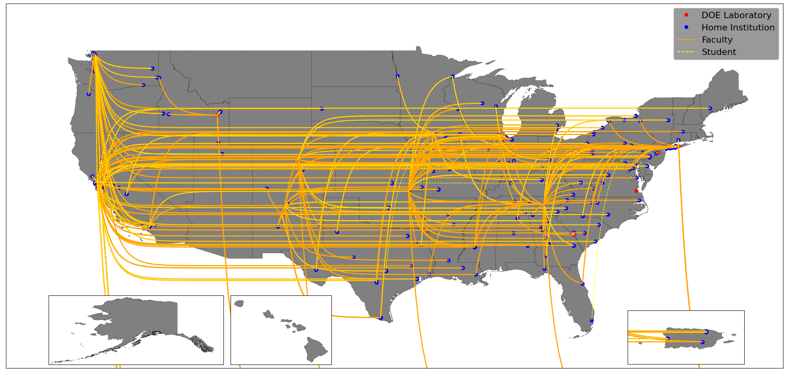
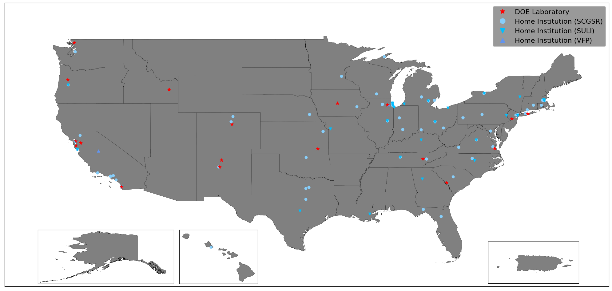

# WDTSscraper

Scrape [US Department of Energy (DOE)](https://www.energy.gov/) [Office of Science](https://science.osti.gov/) [Workforce Development for Teachers and Scientists (WDTS)](https://science.osti.gov/wdts) produced PDF files for information about DOE run STEM pipeline programs. The information is taken from [WDTS](https://science.osti.gov/wdts), the [US Census Bureau](https://www.census.gov/), and the [US Department of Education](https://www.ed.gov/). 

The currently list of STEM pipeline programs whose information can be gathered and parsed are:
  - [Community College Internships (CCI)](https://science.osti.gov/wdts/cci)
  - [Office of Science Graduate Student Research (SCGSR) Program](https://science.osti.gov/wdts/scgsr)
  - [Science Undergraduate Laboratory Internships (SULI)](https://science.osti.gov/wdts/suli)
  - [Visiting Faculty Program (VFP)](https://science.osti.gov/wdts/vfp)

To report a bug or request a feature, please [file an issue](https://github.com/aperloff/WDTSscraper/issues/new/choose).

Table of Contents
=================
<!-- MarkdownTOC autolink="true" -->

- [Installation](#installation)
- [Command line interface](#command-line-interface)
  - [Basic example](#basic-example)
  - [Options](#options)
  - [Tools](#tools)
- [Examples](#examples)
- [Dependencies](#dependencies)
- [Acknowledgments / Contributors](#acknowledgments--contributors)
- [Contributing](#contributing)

<!-- /MarkdownTOC -->

## Installation

```bash
git clone git@github.com:aperloff/WDTSscraper.git
python3 python/check_for_dependencies.py
data/download.sh
```

## Command line interface

### Basic example

```python
python3 python/WDTSscraper.py -C python/configs/config_all-programs_2021.py
```

The output will be an image file.

### Options

The command line options available are:

  - `-d, --debug`: Shows some extra information in order to debug this program (default = False)
  - `-f, --files [files]`: The absolute paths to the files to scrape
  - `-F, --formats [formats]`: List of formats with which to save the resulting map (choices = [`png`,`pdf`,`ps`,`eps`,`svg`], default = [`png`])
  - `-i, --interactive`: Show the plot during program execution
  - `-n, --no-lines`: Do not plot the lines connecting the home institutions and the national laboratories
  - `-N, --no-draw`: Do not create or save the resulting map
  - `-O, --output-path=OUTPUTPATH`: Directory in which to save the resulting maps (default = `os.cwd()`)
  - `-S, --strict-filtering`: More tightly filter out participants by removing those whose topic is unknown
  - `-t, --types [types]`: A list of the types of files being processed (choices = [`VFP`,`SULI`,`CCI`,`SCGSR`])
  - `-T, --filter-by-topic`: Filter the participants by topic if the topic is available
  - `-y, --years [years]`: A list of years to help determine how to process each file

The number of files, types, and years must be equal (i.e. you can't specify 10 input files and years, but only 9 program names).

### Tools

There are two tools used for managing the input data collected from the US government:

  - `data/download.sh`: This is used for downloading and extracting the entire collection of needed input files. It gathers US map information from the Census Bureau, post-secondary school information from the Department of Education, and DOE program participation from WDTS.
  - `data/clean.sh`: This will remove all sub-directories within the `data/` directory. This effectively wipes the slate clean. Make sure not to store any valuable files within these sub-directories.

## Examples

Here are some examples of the types of images which can be created.

The first one displays the DOE national laboratories involved in the VFP, the home institutions for the faculty and students involved, and the connections between those home institutions and the national laboratories. The plot covers from 2015 to 2021 and includes all research areas.



The second image shows the DOE national laboratories and home institutions involved in the CCI, SCGSR, SULI, and VFP programs, but only for students and faculty verifiably involved in high energy physics (HEP) research. Because there was no information about the type of research being done by CCI participants, there are no makers on the plot for that programs. Once again this plot covers from 2015 to 2021.



## Dependencies

Required dependencies:
  - `Python 3`
  - [`pdfplumber`](https://pypi.org/project/pdfplumber/) ([GitHub](https://github.com/jsvine/pdfplumber)): Used to extract text and tables from PDFs.
    - Can be installed using the command `pip3 install --no-cache-dir pdfplumber`
    - This program has several of its own optional dependencies. More information can be found [here](https://github.com/jsvine/pdfplumber#visual-debugging).
      - [`ImageMagick`](https://www.imagemagick.org/): [Installation instructions](http://docs.wand-py.org/en/latest/guide/install.html#install-imagemagick-debian)
      - [`ghostscript`](https://www.ghostscript.com/)): [Installation instructions](https://www.ghostscript.com/doc/9.21/Install.htm)
      - **For MAC users**: Optionally by programs can be installed using the command `brew install freetype imagemagick ghostscript`
  - [`magiconfig`](https://pypi.org/project/magiconfig/) ([GitHub](https://github.com/kpedro88/magiconfig/)): Used to read Python configuration files.
    - Can be installed using the command `pip3 install --no-cache-dir magiconfig`
  - [`matplotlib`](https://matplotlib.org/): Used for plotting the scraped data.
    - Installation instructions can be found [here](https://matplotlib.org/stable/users/installing/index.html).
    - **TLDR**: Install using the command`pip3 install --no-cache-dir matplotlib`
  - `mpl_toolkits`: Should be installed when you install `matplotlib`. In other words, you shouldn't need to do anything extra.
  - [`GeoPandas`](https://geopandas.org/en/stable/index.html): This library is used to parse geographic data and to visualize it using `matplotlib`.
    - Installation instructions can be found [here](https://geopandas.org/en/stable/getting_started/install.html#installing-with-pip).
    - **TLDR**: You can install it using the command `pip3 install --no-cache-dir numpy pandas shapely fiona pyproj rtree GeoAlchemy2 geopy mapclassify matplotlib geopandas`

## Acknowledgments / Contributors

Many thanks to the following users who've contributed ideas, features, and fixes:

  - Michael Cook
  - Adam Lyon
  - Kevin Pedro

## Contributing

Pull requests are welcome, but please submit a proposal issue first, as the library is in active development.

Current maintainers:

  - Alexx Perloff